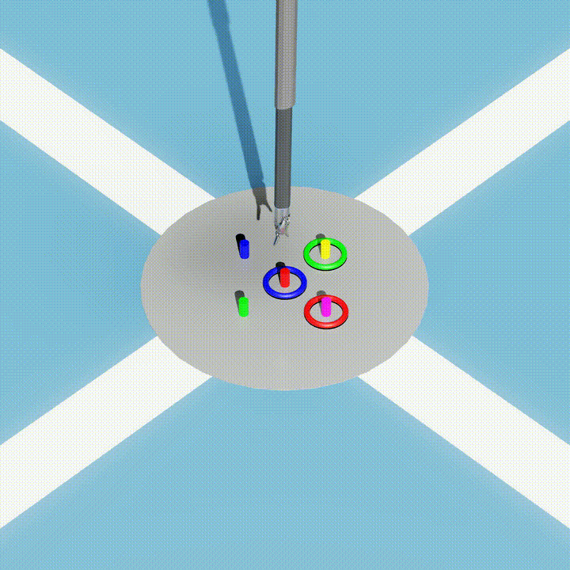

# Surgical PDDL Sim

This project provides a means of evaluating the applicability of PDDL plans generated for a set of surgical tasks by executing them on a simulated [dVRK](https://www.intuitive-foundation.org/dvrk/). The simulation takes in a set of PDDL plans for a specific domain and problem generated by the [pddl\_pipeline](https://github.com/vDawgg/pddl_pipeline) and grounds the actions by resolving the specified objects in the simulation. The only actions currently available to control the dVRK are: ```move```, ```pick``` and ```place```.

The available tasks consist of the following domains:

## ring\_and\_peg

A set of coloured rings need to be transferred on a set of rings of the same colour using a single dVRK Patient Side Manipulator (PSM). This task is inspired by a task originally proposed by [Derossis et al.](https://doi.org/https://doi.org/10.1016/S0002-9610(98)00080-4) for training and evaluating laparoscopic skills.



## needle\_sorting

A set of coloured needles needs to be transferred on a set of pates with the same colour using a single dVRK PSM. This task is inspired by a tasks that was originally developed for the dV-Trainer &#174; (MIMIC Technologies &#174;) training simulator intended for daVinci surgical robotics platforms.


## needle\_transfer

A needle needs to be transferred between two dVRK PSMs by passing the needle through a set of rings in a specific sequence. As the ```needle_transfer``` task, this task is inspired by a task from the dV-Trainer &#174; simulator.


# Setup

To properly set up this project we recommend the following

Use venvs for isaac-sim. If you want auto-completion inside vscode, we recommend setting up a second venv with the same packages, just to run the auto-complete support. This is recommended, as the script to set up the auto-complete breaks running the simulation.
The venvs can easilly be set up using uv:

```uv venv --python 3.11 venv```

Note, that python 3.11 is required by the version of isaac-sim used in this project.

Install the packages by running:

```uv pip install "isaacsim[all,extscache]==5.1.0" --extra-index-url https://pypi.nvidia.com```

Additionally, for the generation of the results, you need to install polars and opencv for the optional video recording.

```uv pip install polars opencv-python-headless```

The settings.json for vscode can then be generated by running:

```python -m isaacsim --generate-vscode-settings```

# Running the project

The simulation environment in this repository is intended as a means of validating the plans generated by the [pddl\_pipeline](https://github.com/vDawgg/pddl_pipeline). For this purpose, the program expects a csv-formatted results file generated by the erval.py script from the pddl\_pipeline and the specification of the specific domain and problem that the results were generated for. Note, that for simplicities sake, we expect the files to have either been generated on the same system or mounted to directories with the same path name when running inside docker containers, so that the paths to the plan files in the results csv are resolved correctly.

An exemplary program execution would look like the following:
```bash
uv run main.py \
--domain ring_and_peg \
--problem ring_and_peg_1 \
--pipeline_results results/ring_and_peg_1.csv
```
To view all available options, run ```uv run main.py --help```

Exemplary plans under [sample_results](data/sample_results/) can be used as input for testing the sim.

If the ```--write-results``` flag is passed, the results (success of the given plans) are written to the same results file to ensure a single source for the evaluation. The default behavior does not write the simulation results to the file.

The easiest way to run the simulation on results generated using the [pipeline](https://git.tu-berlin.de/shuai_ws/students/veit_ws/pddl_pipeline) are to execute the simulation inside of the pipeline directory so that the relative paths properly resolve.

# Docker

The project includes a Dockerfile that builds a complete Isaac Sim environment with all dependencies pre-installed. Note, that for GPU support, the [nvidia-container toolkit](https://docs.nvidia.com/datacenter/cloud-native/container-toolkit/latest/install-guide.html) needs to be installed on the host system.

## Building the image

Build the Docker image with:

```bash
docker build -t sim:latest .
```

## Running the container

To run the container, use `docker run`. The container requires:

- `--gpus all`: Enable GPU access
- `-e DISPLAY`: X11 display variable (for GUI, if needed)

When the results of the sim-runs should be written back to the results.csv, run ```chmod -R 777 ./results``` to allow the container to write to the files before executing the docker run command.

## Command-line arguments

All arguments are passed directly to `main.py`. Use `--help` to see available options:

```bash
docker run --rm isaac-sim-test:latest --help
```

### Example Run

To run the simulation with GUI visualization for the needle_transfer_1 problem:

```bash
docker run --rm --gpus all --network=host \
  -e DISPLAY=$DISPLAY \
  -v /tmp/.X11-unix:/tmp/.X11-unix \
  -v $HOME/.Xauthority:/isaac-sim/.Xauthority \
  -v ./results:/app/results \
  -v ./plans:/app/plans \
  sim:latest \
  --domain needle_transfer --problem needle_transfer_1 \
  --pipeline_results /app/results/needle_transfer_1.csv --write_results
```

Note: X11 forwarding requires your X server to allow connections from the container. You may need to run `xhost +local:docker` before launching the container.

# Acknowledgement

The dVRK is based on [orbit-surgical](https://github.com/orbit-surgical/orbit-surgical) by Masoud Moghani et. al
